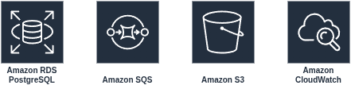

# AWS Integration

This document outlines the AWS services that would back the episode duplication system in production.  
My direct AWS experience is limited, so the choices below lean on documented best practices.

## Services
We could use the following services.



### Database (RDS PostgreSQL)
Run the relational workload on Amazon RDS for PostgreSQL. CloudWatch metrics (CPU, connections, I/O) feed into our queue middleware so jobs can pause or slow down when the database gets hot.

### Queue Management (SQS)
Use an SQS FIFO queue dedicated to duplications. FIFO requires a message group ID—use the duplication ID so jobs for the same episode run serially—and supports message deduplication via a `deduplicationId` method on each job:
```php
    /**
     * Get the job's deduplication ID.
     */
    public function deduplicationId(): string
    {
        return "duplication-{$this->$duplicationId}";
    }
```

### File Storage (S3)
Store media assets in Amazon S3, keep canonical object keys in the database, and issue pre-signed URLs when clients need temporary access so the bucket stays private.

### Monitoring & Logging (CloudWatch)

### Key Metrics
- Job processing rates and success/failure ratios
- Database load
- Queue depth and processing latency
- Application response times

### Alerting
- Critical: Job failure rates above threshold
- Warning: Queue depth growing unusually
- Info: System performance metrics

### Logging
- Push structured JSON logs to CloudWatch (or Loki) so they can be queried easily.
- Include correlation IDs/request IDs whenever possible.
- Surface domain-specific errors via custom exceptions for better filtering.

### Open telemetry
- Use OTEL Traces & metrics to provide additional information.
- I've added comments in code with prefix "OTEL: " where we would add traces/spans
- Omitted adding events to spans, etc.
