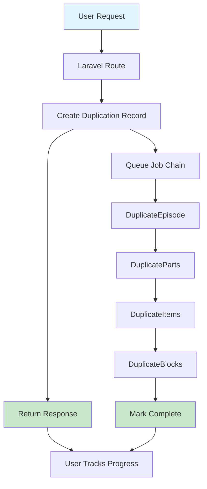
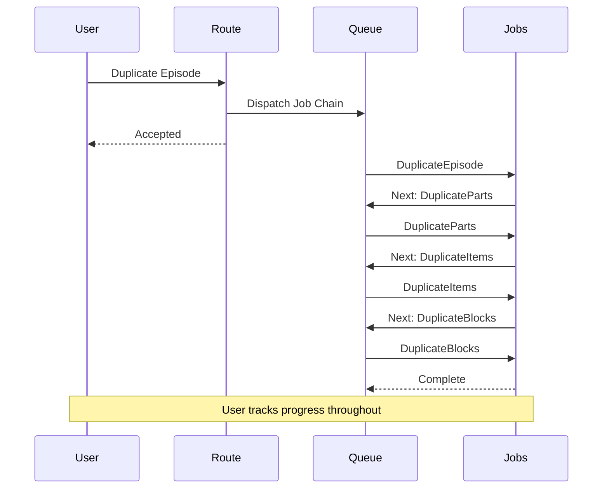
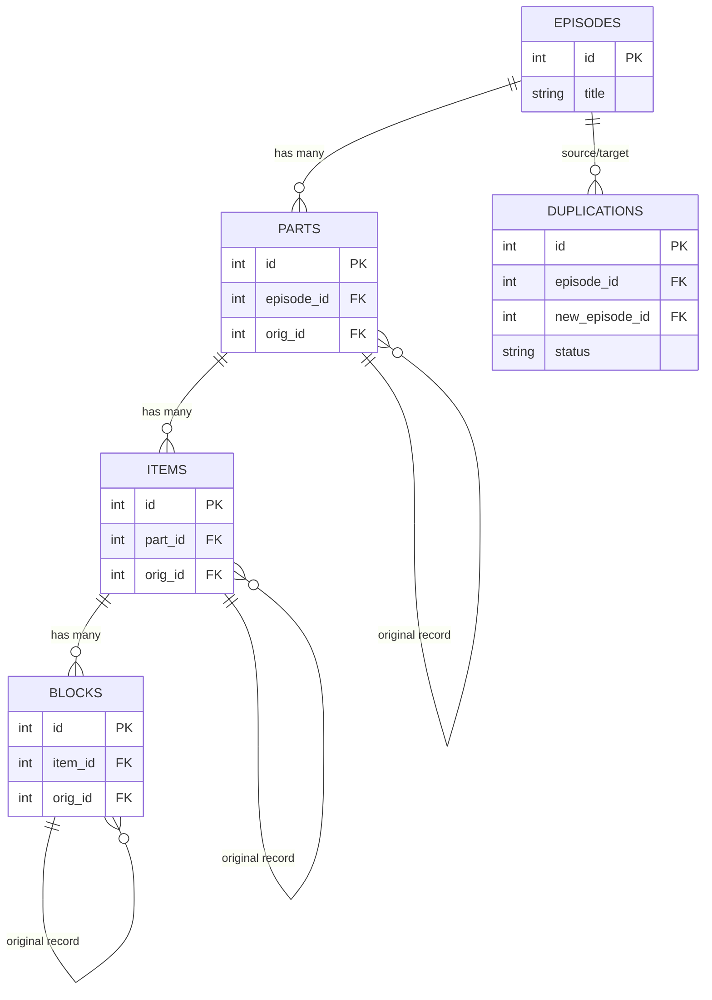

# High level overview

Our solution uses asynchronous job chains to duplicate Episodes and their nested hierarchy (Parts > Items > Blocks) without blocking users or overwhelming the database.  
A `EpisodeDuplication` wrapper orchestrates the process, tracking progress and status across four sequential jobs that chunk and bulk-insert records at each level.  
This approach ensures scalability, enables real-time progress feedback, and allows graceful failure handling with transaction-level retries.  
Users receive immediate confirmation and can monitor duplication progress through broadcasts and notifications.

## Architecture Diagrams

### 1. Architecture Flow Diagram

### 2. Job Chain Sequence Diagram

### 3. Database Schema Diagram

