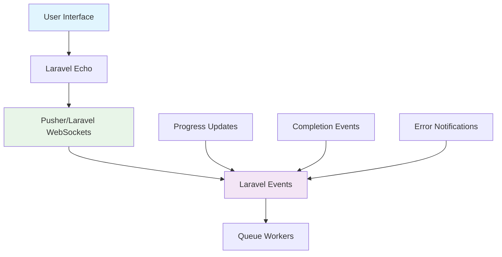

> Note: This document has been superseded by user-feedback.md, which outlines the high-level user feedback strategy (no implementation details). The details below were part of an earlier implementation-focused draft and can be ignored if you're looking for product/UX guidance.
>
> At a glance:
> - We broadcast events to clients so the UI stays up to date in real time.
> - For lengthy workflows (e.g., duplication), we send an out-of-band notification (email, Slack, etc.) on completion.


# Broadcasting & Events

## Overview

This document covers real-time communication with users during episode duplication, including WebSocket connections, server-sent events, and notification systems.

## Broadcasting Architecture



## Event System

### Duplication Events

**DuplicationStarted Event:**
```php
class DuplicationStarted implements ShouldBroadcast
{
    use Dispatchable, InteractsWithSockets, SerializesModels;

    public function __construct(
        public EpisodeDuplication $duplication
    ) {}

    public function broadcastOn()
    {
        return new PrivateChannel('duplications.' . $this->duplication->id);
    }

    public function broadcastAs()
    {
        return 'duplication.started';
    }

    public function broadcastWith()
    {
        return [
            'duplication_id' => $this->duplication->id,
            'episode_id' => $this->duplication->episode_id,
            'status' => $this->duplication->status,
            'started_at' => $this->duplication->created_at->toISOString(),
        ];
    }
}
```

**ProgressUpdated Event:**
```php
class ProgressUpdated implements ShouldBroadcast
{
    use Dispatchable, InteractsWithSockets, SerializesModels;

    public function __construct(
        public EpisodeDuplication $duplication,
        public string $stage,
        public int $count
    ) {}

    public function broadcastOn()
    {
        return new PrivateChannel('duplications.' . $this->duplication->id);
    }

    public function broadcastAs()
    {
        return 'duplication.progress';
    }

    public function broadcastWith()
    {
        return [
            'duplication_id' => $this->duplication->id,
            'stage' => $this->stage,
            'count' => $this->count,
            'total_progress' => $this->duplication->progress,
            'percentage' => $this->calculatePercentage(),
        ];
    }

    private function calculatePercentage(): float
    {
        $progress = $this->duplication->progress ?? [];
        $total = array_sum($progress);
        $expected = 1000; // Expected total records

        return min(($total / $expected) * 100, 100);
    }
}
```

**DuplicationCompleted Event:**
```php
class DuplicationCompleted implements ShouldBroadcast
{
    use Dispatchable, InteractsWithSockets, SerializesModels;

    public function __construct(
        public EpisodeDuplication $duplication,
        public Episode $newEpisode
    ) {}

    public function broadcastOn()
    {
        return new PrivateChannel('duplications.' . $this->duplication->id);
    }

    public function broadcastAs()
    {
        return 'duplication.completed';
    }

    public function broadcastWith()
    {
        return [
            'duplication_id' => $this->duplication->id,
            'new_episode_id' => $this->newEpisode->id,
            'new_episode_title' => $this->newEpisode->title,
            'completed_at' => now()->toISOString(),
            'total_time' => $this->duplication->created_at->diffInSeconds(now()),
        ];
    }
}
```

## Frontend Integration

### Laravel Echo Setup

**Configuration:**
```javascript
// resources/js/bootstrap.js
import Echo from 'laravel-echo';
import Pusher from 'pusher-js';

window.Echo = new Echo({
    broadcaster: 'pusher',
    key: import.meta.env.VITE_PUSHER_APP_KEY,
    cluster: import.meta.env.VITE_PUSHER_APP_CLUSTER,
    forceTLS: true
});
```

**Duplication Progress Component:**
```javascript
// resources/js/components/DuplicationProgress.vue
<template>
    <div class="duplication-progress">
        <div class="progress-header">
            <h3>Duplicating Episode</h3>
            <span class="status">{{ status }}</span>
        </div>

        <div class="progress-bar">
            <div
                class="progress-fill"
                :style="{ width: percentage + '%' }"
            ></div>
        </div>

        <div class="progress-details">
            <div v-for="(count, stage) in progress" :key="stage">
                {{ stage }}: {{ count }} records
            </div>
        </div>

        <div v-if="error" class="error-message">
            {{ error }}
        </div>
    </div>
</template>

<script>
export default {
    props: ['duplicationId'],

    data() {
        return {
            status: 'pending',
            progress: {},
            percentage: 0,
            error: null,
            newEpisodeId: null
        };
    },

    mounted() {
        this.subscribeToUpdates();
        this.loadInitialStatus();
    },

    methods: {
        subscribeToUpdates() {
            window.Echo.private(`duplications.${this.duplicationId}`)
                .listen('duplication.started', (e) => {
                    this.status = 'started';
                    this.updateProgress(e);
                })
                .listen('duplication.progress', (e) => {
                    this.updateProgress(e);
                })
                .listen('duplication.completed', (e) => {
                    this.status = 'completed';
                    this.newEpisodeId = e.new_episode_id;
                    this.percentage = 100;
                    this.$emit('completed', e);
                })
                .listen('duplication.failed', (e) => {
                    this.status = 'failed';
                    this.error = e.error;
                    this.$emit('failed', e);
                });
        },

        updateProgress(event) {
            this.progress = event.total_progress || {};
            this.percentage = event.percentage || 0;
        },

        async loadInitialStatus() {
            try {
                const response = await axios.get(`/api/duplications/${this.duplicationId}`);
                this.status = response.data.status;
                this.progress = response.data.progress || {};
            } catch (error) {
                console.error('Failed to load duplication status:', error);
            }
        }
    }
};
</script>
```

## Server-Sent Events Alternative

### SSE Controller

**SSE Endpoint:**
```php
class DuplicationSSEController extends Controller
{
    public function stream($duplicationId)
    {
        $duplication = EpisodeDuplication::findOrFail($duplicationId);

        $response = new StreamedResponse(function () use ($duplication) {
            while (true) {
                $duplication->refresh();

                $data = [
                    'id' => time(),
                    'event' => 'update',
                    'data' => json_encode([
                        'status' => $duplication->status,
                        'progress' => $duplication->progress,
                        'percentage' => $this->calculatePercentage($duplication),
                    ])
                ];

                echo "id: {$data['id']}\n";
                echo "event: {$data['event']}\n";
                echo "data: {$data['data']}\n\n";

                ob_flush();
                flush();

                if (in_array($duplication->status, ['completed', 'failed'])) {
                    break;
                }

                sleep(2); // Poll every 2 seconds
            }
        });

        $response->headers->set('Content-Type', 'text/event-stream');
        $response->headers->set('Cache-Control', 'no-cache');
        $response->headers->set('Connection', 'keep-alive');

        return $response;
    }
}
```

**SSE JavaScript Client:**
```javascript
class DuplicationSSE {
    constructor(duplicationId, onProgress, onComplete, onError) {
        this.duplicationId = duplicationId;
        this.onProgress = onProgress;
        this.onComplete = onComplete;
        this.onError = onError;
        this.eventSource = null;
    }

    connect() {
        this.eventSource = new EventSource(
            `/api/duplications/${this.duplicationId}/stream`
        );

        this.eventSource.addEventListener('update', (event) => {
            const data = JSON.parse(event.data);

            if (data.status === 'completed') {
                this.onComplete(data);
                this.disconnect();
            } else if (data.status === 'failed') {
                this.onError(data);
                this.disconnect();
            } else {
                this.onProgress(data);
            }
        });

        this.eventSource.onerror = (error) => {
            console.error('SSE Error:', error);
            this.onError({ error: 'Connection lost' });
        };
    }

    disconnect() {
        if (this.eventSource) {
            this.eventSource.close();
            this.eventSource = null;
        }
    }
}
```

## Notification System

### Email Notifications

**Duplication Completed Notification:**
```php
class DuplicationCompletedNotification extends Notification
{
    use Queueable;

    public function __construct(
        private EpisodeDuplication $duplication,
        private Episode $newEpisode
    ) {}

    public function via($notifiable)
    {
        return ['mail', 'database'];
    }

    public function toMail($notifiable)
    {
        return (new MailMessage)
            ->subject('Episode Duplication Completed')
            ->greeting('Hello ' . $notifiable->name)
            ->line('Your episode duplication has been completed successfully.')
            ->action('View New Episode', route('episodes.show', $this->newEpisode->id))
            ->line('Original Episode: ' . $this->duplication->episode->title)
            ->line('New Episode: ' . $this->newEpisode->title)
            ->line('Duration: ' . $this->duplication->created_at->diffForHumans(now(), true));
    }

    public function toDatabase($notifiable)
    {
        return [
            'duplication_id' => $this->duplication->id,
            'new_episode_id' => $this->newEpisode->id,
            'message' => 'Episode duplication completed',
            'type' => 'success'
        ];
    }
}
```

### Push Notifications

**Web Push Notification:**
```php
class WebPushNotification
{
    public function sendDuplicationCompleted($user, $duplication, $newEpisode)
    {
        $subscription = $user->pushSubscriptions()->first();

        if (!$subscription) {
            return;
        }

        $payload = json_encode([
            'title' => 'Duplication Completed',
            'body' => "Episode '{$newEpisode->title}' has been duplicated",
            'icon' => '/icon.png',
            'badge' => '/badge.png',
            'data' => [
                'url' => route('episodes.show', $newEpisode->id),
                'duplication_id' => $duplication->id
            ]
        ]);

        Http::post($subscription->endpoint, $payload, [
            'Authorization' => 'key=' . config('services.vapid.public_key'),
            'TTL' => 3600,
            'Content-Type' => 'application/json',
            'Content-Length' => strlen($payload)
        ]);
    }
}
```

## Configuration

### Broadcasting Configuration

**config/broadcasting.php:**
```php
'connections' => [
    'pusher' => [
        'driver' => 'pusher',
        'key' => env('PUSHER_APP_KEY'),
        'secret' => env('PUSHER_APP_SECRET'),
        'app_id' => env('PUSHER_APP_ID'),
        'options' => [
            'cluster' => env('PUSHER_APP_CLUSTER'),
            'useTLS' => true,
            'encrypted' => true,
            'host' => env('PUSHER_HOST') ?: 'api-'.env('PUSHER_APP_CLUSTER', 'mt1').'.pusherapp.com',
            'port' => env('PUSHER_PORT', 443),
            'scheme' => env('PUSHER_SCHEME', 'https'),
        ],
    ],
],
```

### Routes

**API Routes:**
```php
// routes/api.php
Route::get('/duplications/{duplication}/stream', [DuplicationSSEController::class, 'stream']);
Route::get('/duplications/{duplication}', [DuplicationController::class, 'show']);
Route::post('/episodes/{episode}/duplicate', [DuplicationController::class, 'duplicate']);
```

**Broadcast Routes:**
```php
// routes/channels.php
Broadcast::channel('duplications.{duplicationId}', function ($user, $duplicationId) {
    $duplication = EpisodeDuplication::find($duplicationId);

    if (!$duplication) {
        return false;
    }

    // User can access if they own the original episode
    return $duplication->episode->user_id === $user->id;
});
```

## Performance Considerations

### Event Broadcasting Optimization

**Batch Progress Updates:**
```php
class BatchProgressUpdater
{
    private $updates = [];
    private $lastBroadcast = 0;

    public function addUpdate($duplicationId, $stage, $count)
    {
        $this->updates[$duplicationId][$stage] = ($this->updates[$duplicationId][$stage] ?? 0) + $count;

        // Broadcast every 5 seconds or every 100 records
        if (time() - $this->lastBroadcast > 5 || $count >= 100) {
            $this->broadcastUpdates();
            $this->lastBroadcast = time();
        }
    }

    private function broadcastUpdates()
    {
        foreach ($this->updates as $duplicationId => $progress) {
            $duplication = EpisodeDuplication::find($duplicationId);

            if ($duplication) {
                event(new ProgressUpdated($duplication, array_keys($progress)[0], array_sum($progress)));
            }
        }

        $this->updates = [];
    }
}
```

### Connection Management

**WebSocket Connection Limits:**
```php
// In your broadcasting service provider
public function boot()
{
    Broadcast::routes(['middleware' => ['auth', 'throttle:60,1']]);

    // Limit concurrent connections per user
    Broadcast::channel('duplications.*', function ($user) {
        if ($user->activeConnections >= 10) {
            return false;
        }

        $user->increment('activeConnections');

        register_shutdown_function(function () use ($user) {
            $user->decrement('activeConnections');
        });

        return true;
    });
}
```

## Security Considerations

### Channel Authorization
- Always verify user permissions for private channels
- Rate limit WebSocket connections
- Validate all incoming data

### Data Exposure
- Never broadcast sensitive information
- Sanitize all broadcasted data
- Use HTTPS for all connections

### Authentication
- Require authentication for private channels
- Implement proper token validation
- Log all connection attempts